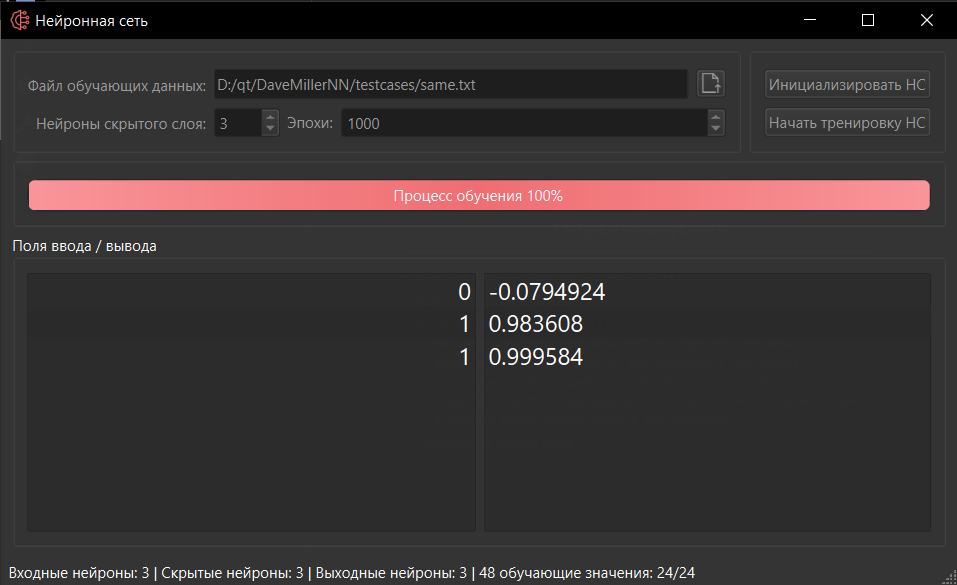

# DaveMillerNN - Реализация Нейронной Сети

[English](README.md) | Русский

Реализация многослойной нейронной сети с графическим интерфейсом на базе Qt. Проект демонстрирует принципы работы нейронных сетей на практических примерах логических операций.

## Интерфейс

## Возможности
- Настраиваемая топология нейронной сети
- Визуализация процесса обучения
- Поддержка различных наборов данных для обучения
- Тестирование сети в реальном времени
- Удобный интерфейс на Qt

## Тестовые Примеры
Проект включает несколько тестовых наборов:
- Операция XOR (исключающее ИЛИ)
- Расширенные операции ИЛИ
- Сложные логические операции
- Импликация
- Пользовательские логические задачи

## Технологии
- C++
- Фреймворк Qt
- Компоненты нейронной сети:
  - Класс нейрона с обратным распространением
  - Система управления сетью
  - Модуль обучения

## Требования
- Qt 5.x или выше
- Компилятор C++ с поддержкой C++11
- CMake для сборки

## Установка
1. Клонируйте репозиторий
2. Откройте проект в Qt Creator
3. Соберите и запустите приложение

## Использование
1. Выберите файл с обучающими данными
2. Настройте топологию сети
3. Инициализируйте сеть
4. Запустите процесс обучения
5. Протестируйте сеть на собственных входных данных

## Лицензия
Проект предоставляется как есть в образовательных целях.